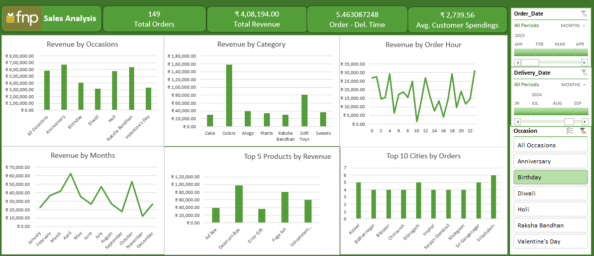

# 📊 FNP Sales Analysis Dashboard

## 📌 Project Overview

This project presents an interactive Sales Analytics Dashboard developed in Microsoft Excel using Power Query and Power Pivot. The dashboard analyzes sales performance, customer purchasing patterns, product trends, and delivery metrics to support business decision-making.

---

## 🎯 Business Problem

Ferns and Petals (FNP) wanted to understand:

- Which occasions generate maximum revenue?
- Which products contribute most to sales?
- Which cities generate maximum revenue?
- Monthly sales trends
- Average delivery time

---

## 🛠️ Tools Used

- Microsoft Excel
- Power Query
- Power Pivot
- Pivot Tables
- Pivot Charts
- Data Modeling

---

## 📂 Dataset

The project uses three datasets:

- customers.csv
- orders.csv
- products.csv

---

## 📈 Dashboard KPIs

- Total Revenue
- Revenue by Occasion
- Monthly Revenue
- Top 5 Products
- Top 10 Cities
- Average Delivery Time

---

## 💡 Business Insights

- Identified top-performing occasions based on revenue.
- Analysed monthly sales trends.
- Compared city-wise sales performance.
- Evaluated average delivery timelines.
- Identified best-selling products.

---

## 📁 Repository Structure

FNP_Sales_Analysis_Dashboard.xlsx

Dashboard.png

customers.csv

orders.csv

products.csv

README.md

---

## 👨‍💻 Author

Aditya Kishor Humbare

LinkedIn:
